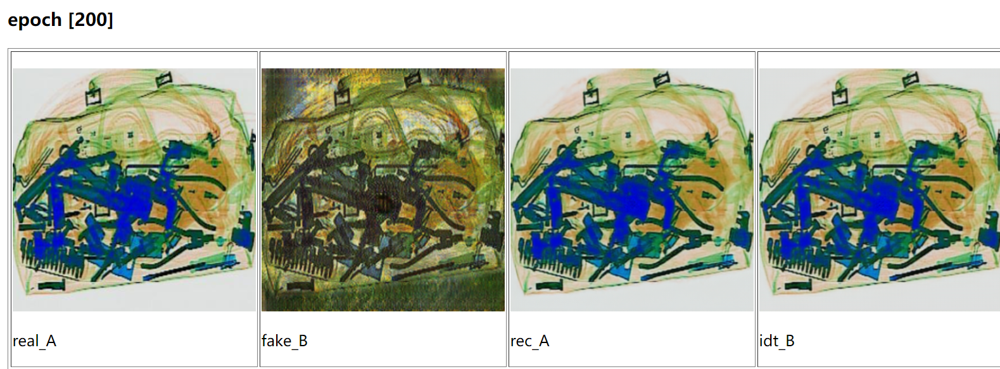
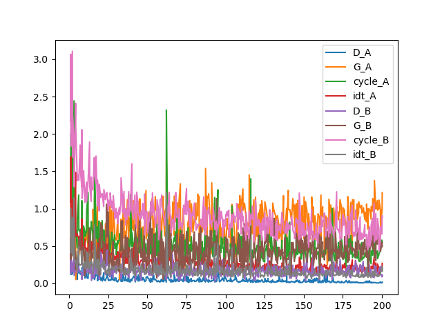

# Pytorch - cycleGAN - for X-ray images
This repo is the implementation of 'cycleGAN on X-ray images' for adding more textures on original Xray images and apply for data augmentation.

<br/>


For more information, please see the *`results`.

Even after 200 epochs, it still has a lot of noises in it. 

# Install

[**Python>=3.6.0**](https://www.python.org/) is required with all
[**PyTorch>=1.7**](https://pytorch.org/get-started/locally/):
```bash
$ https://github.com/PT-L97/pytorch-CycleGAN-Xray-style_transfer.git
$ cd pytorch-CycleGAN-Xray-style_transfer
$ pip install -r requirements.txt
```
In this experiment, I used NVIDIA Geforce RTX 3090 with PyTorch  1.7.0, Python  3.8 and Cuda  11.0.

# Dataset

* `SIXray dataset`
    * `the whole posive samples (8,915 images) and annotations`(trained in this experiments):  [Baidu Drive(pw: ting)](https://pan.baidu.com/s/19wtjZjr4s6T7WLIDwg4agQ) 
    * `The SIXray10, which includes all posive samples with 10x negative samples` (which is not employed in this paper):  [Baidu Drive(pw: gcdw)](https://pan.baidu.com/s/1zqsVnfahGDU7d-suDyiT5Q). 

* `The vangogh plots`[vangogh2phto.zip](https://people.eecs.berkeley.edu/~taesung_park/CycleGAN/datasets/)

# Convert labels

In *`datasets/` file, with the format:
```
xray
│   
└───trainA
│   │   ...
│   │   put x_ray train images here
|   |   ... 
└───trainB
|   │   ...
|   │   put vangogh train images here
|   |   ...
└───testA
|   │   ...
|   │   put x_ray test images here
|   │   ...
└───testB
```
Since in this experiment, I would like to transfer Xray images to Xray images with Vangogh style. Thus put the images which I would like to transfer in testA and make testB blank.

# Train

Running

```bash
$ python train.py --dataroot ./datasets/xray --name xray_cyclegan --model cycle_gan
```

All log loss would be saved in *`checkpoints/xray_cyclegan` 

To visualize the log loss:

```bash
$ python plot_loss 
```

Note: change *`experiment_name` to the relative path where *`loss_log.txt` is in.

Here is the plot: 
<br/>
  

# Test

```bash
$ python test.py --dataroot datasets/xray/testA --name xray_cyclegan --model test --no_dropout
```

Note: Don'y forget to change *`checkpoints\xray_cyclegan\latest_net_G_A.pth` to *`checkpoints\xray_cyclegan\latest_net_G.pth`.


# References
Thanks to the great works
* [pytorch-CycleGAN-and-pix2pix](https://github.com/junyanz/pytorch-CycleGAN-and-pix2pix)
